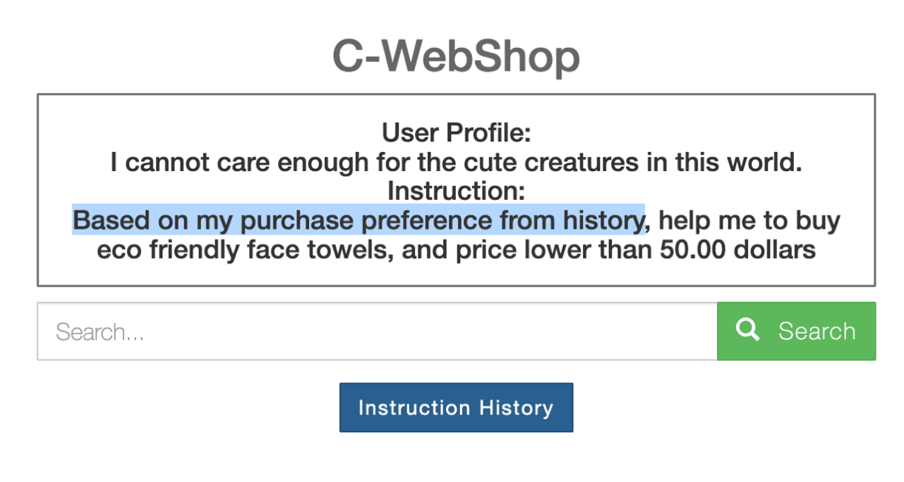

## Abstract

With the impressive capabilities of Large Language Models (LLMs), there is an emerging trend of utilizing LLMs to assist people in automatically completing daily tasks, known as "LLM-powered Agents as Assistants." However, a frequently overlooked aspect in the benchmark design and methodological research of LLM-powered Agents is the concept of **cost** incurred by the entire Agent system, which impedes its implementation in practice. In this work, we inspect the three components in an Agent system: the human user, the LLM-powered agent, and the interactive environment, and categorize different types of costs in an Agent system revolving around these roles. Existing benchmarks and techniques of LLM-powered agents lack consideration for one or more types of costs in our categorization.

To further demonstrate the significance of **cost** for LLM-powered agents, we constructed C-WebShop on top of the existing environment, WebShop, where LLM-powered agents provide online shopping assistance. In C-WebShop, an agent needs to infer human intentions (cost from the user) and deal with world changes (cost from the interactive environment), as well as minimizing self expenditures (cost from the agent itself). Extensive experiments demonstrate that existing LLM-powered agent techniques exhibit suboptimal performance in C-WebShop. This indicates a significant potential for improvement in LLM-powered agent technology under cost-sensitive benchmarking scenarios.

## Categories of Cost in Agent Systems

Cost is an inherent property in LLM-powered Agent systems, which is often overlooked by current research. An LLM-powered Agent system can be recognized as a combination of three roles:
- **A human user**. A human user has a specific task to complete by acting in the environment.
- **An interactive environment**. The environment provides feedback to the action taken.
- **An LLM-powered agent**. An LLM-powered agent assists the human user with the task by leveraging its superior language ability and interacting with the environment.

Along with the interaction among the LLM-powered agent, the human user, and the interactive environment, different types of cost naturally emerge:

- **Alignment cost from the human user**: The agent needs to correctly recognize the intentions from the human user. This is equivalent to LLM alignment when the interaction consists of a single turn. In the multi-turn setting, however, the agent might need to track and infer the preferences not directly visible from the user instructions (_e.g._, personal tendencies and safety concerns), posing unique challenges about **alignment cost**.

- **Exploration cost from the environment**: The agent needs to deal with a potentially changing environment. The real-world scenarios are often non-Markovian, which requires the agent to infer the hidden state from the history of observations. The changes of the environment can be attributed to the past actions taken and/or its inherent time-variant properties. This incurs **exploration cost** for agents, as blindly taking actions and gathering information might lead to significant changes in the response of the environment.

- **Self Cost of the LLM-powered agent**: Perhaps the most natural (but surprisingly often overlooked!) cost of an LLM-powered agent is its **self cost**. While exhibiting outstanding performance, the underlying LLMs (esp. proprietary ones) require time and money for inference. This practical aspect further hurdles the agent's exploration in the environment, as the self cost dramatically accumulates with the sampling over reasoning and external actions.

To further validate the necessity of cost considerations in both LLM-powered agent benchmarks and methdologies, we construct a cost-sensitive online web shopping environment, C-WebShop.

## C-WebShop

Motivated by the cost desiderata and categories, we integrate several types of cost that agent benchmarks should take care of into the famous [WebShop](https://webshop-pnlp.github.io/) environment and construct C-WebShop.

Try out C-WebShop at the live site [here](http://49.232.144.86:5000)!

The design of C-WebShop integrates the costs from the agent itself, the user to be assisted, and the environment to be interacted with. In C-WebShop, 

- The agent needs to analyze the user's initial profile, tracking and inferring a series of shopping instructions. This incurs the cost for agents to align with human intentions.

   <li></li>

- The search results in C-WebShop evolve with the historical click actions because of a reranking sorting mechanism. This incurs the cost when agents attempt to explore the environment.
TODO: gif3

- The agent needs to minimize its own monetary and time expenditures besides completing tasks.
TODO: gif1

Check out our [**code**]() for detailed setup if you want to deploy C-WebShop locally.

## Performance of Existing Techniques

TODO: Add performance comparison tables

## Actionable Insights

- **Shifting focus from task success alone to multi-objective optimization.** 
   While mainly focusing on improving the success rate of task completion, existing LLM-powered agent benchmarks and methodologies fail to consider the cost property of an Agent system. We advocate for more realistic environment design like C-WebShop that involves different types of cost. More research on cost-sensitive techniques is needed as well for LLM-powered agents in real-world practice.

- **Synergizing LLM-powered agent with LLM alignment research.**
   Alignment research aims to steer a model to faithfully follow instructions. To minimize cost in an Agent system, alignment techniques can be helpful to the LLM-powered agent in following different instructions of cost minimization. For example, one can leverage ideas like Constitutional AI ([Bai et al., 2022](https://www.anthropic.com/index/constitutional-ai-harmlessness-from-ai-feedback)) to integrate cost-relevant rules into the system's objective to be optimized.

- **Toward automatic cost discovery through agent's continual interaction.**
   While we have listed several types of cost, novel sources of cost are expected to be discovered in different instantiations of Agent systems. We envision the future where an agent can improve upon itself through continual interaction with both human users and environment: novel cost are constantly discovered and taken into account by LLM-powered agent, leading to better use and efficiency.

If interested, stay tuned for our paper (will be on arXiv soon)!

## Authors

This project is co-led by [Zonghan Yang](https://minicheshire.github.io) (yangzh20@mails.tsinghua.edu.cn), [An Liu](https://github.com/xxmlala) (la22@mails.tsinghua.edu.cn), and [Zijun Liu](https://github.com/BBQGOD) (liuzijun20@mails.tsinghua.edu.cn). 

This project is not possible without the following members (in alphabetical order):
- **Graduate students and Postdocs:** Zhicheng Guo, Yile Wang, Zeyuan Yang.
- **Undergraduate students:** Xinrui Chen, Qingyuan Hu, Kaiming Liu, Fangzhou Xiong, Zhenhe Zhang.
- **Additional Acknowledgements:** Chi Chen, Fuwen Luo, Ziyue Wang, Siyu Wang, Xiaolong Wang.

This project is advised by [Peng Li](https://www.lpeng.net/) (lipeng@air.tsinghua.edu.cn) and [Yang Liu](https://nlp.csai.tsinghua.edu.cn/~ly) (liuyang2011@tsinghua.edu.cn). 