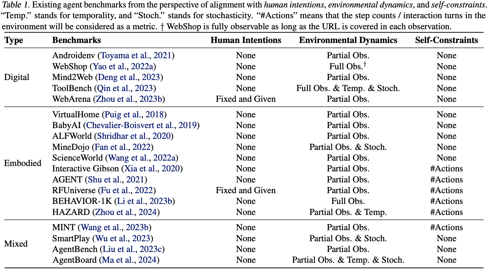
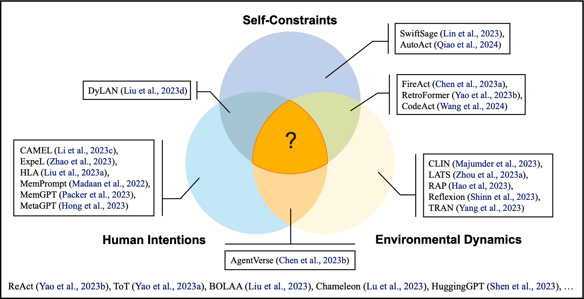
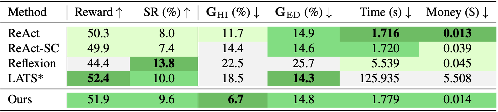

## Abstract

The rapid progress of foundation models has led to the prosperity of autonomous agents, which leverage the universal capabilities of foundation models to conduct reasoning, decision-making, and environmental interaction. However, the efficacy of agents remains limited when operating in intricate, realistic environments. In this work, we introduce the principles of **U**nified **A**lignment for **A**gents (**UA**$$^2$$), which advocate for the simultaneous alignment of agents with human intentions, environmental dynamics, and self-constraints such as the limitation of monetary budgets. From the perspective of **UA**$$^2$$, we review the current agent research and highlight the neglected factors in existing agent benchmarks and method candidates. We also conduct proof-of-concept studies by introducing realistic features to [WebShop](https://webshop-pnlp.github.io/) ([Yao et al., 2022](https://arxiv.org/abs/2207.01206)), including user profiles to demonstrate intentions, personalized reranking for complex environmental dynamics, and runtime cost statistics to reflect self-constraints. We then follow the principles of **UA**$$^2$$ to propose an initial design of our agent and benchmark its performance with several candidate baselines in the retrofitted WebShop. The extensive experimental results further prove the importance of the principles of **UA**$$^2$$. Our research sheds light on the next steps of autonomous agent research with improved general problem-solving abilities.

## Principles of Unified Alignment for Agents

   <div style="text-align:center;">
      
   </div>

Agents, humans, and the environment are the three components that make up a working system of agents. To promote the orchestration of the three roles, the agents should work in the direction of eliminating the gap between agents and humans, agents and the environment, as well as adapting to the constraints imposed on the agents themselves. Based on this, we propose the principles of **U**nified **A**lignment for **A**gents (**UA**$$^2$$). To enumerate:

- The agents should align with *human intentions*. The agents need to correctly recognize the intentions of humans, including their user profiles, ambiguity in texts, as well as safety concerns. Aside from LLM alignment research which is formed of mostly a single prompt-response pair, specific challenges for agents lie in the nature of multi-turn interaction. Through multiple rounds of investigation, the agents should either elicit human preferences ([Li et al., 2023](https://arxiv.org/abs/2310.11589)), or learning to self-correct from environmental feedback ([Huang et al., 2023](https://arxiv.org/abs/2310.01798)), or both.

- The agents should align with *environmental dynamics*. To succeed in goal achievements, the agents should raise their awareness of the operation laws of the environment, the complexity of which emerges from the partial observability, time-variant property, stochasticity, etc. This is also advocated in ([LeCun, 2022](https://openreview.net/forum?id=BZ5a1r-kVsf)) and ([Hu & Shu, 2023](https://arxiv.org/abs/2312.05230)) that propose to construct and incorporate a world model into an agent system.

- The agents should align with *self-constraints*. The underscored factor of current agent research and development is the constraints imposed on the agents themselves, including time and/or money budget limits. For foundation model agents, the underlying models (*e.g.*, proprietary LLMs/LMMs) are costly for inference, which hurdles the performance of agents in realistic scenarios.

## Literature Review from the Lens of UA$$^2$$

According to the principles of **UA**$$^2$$, we review the existing benchmarks and methods of agents and check if they suffice the development of agents in holistic real-world scenarios. Detailed analysis can be found in Section 3 of our [paper](https://arxiv.org/abs/2402.07744).

### Benchmarks

For benchmarks, we review both the digital and the embodied ones, and consider the following three aspects:

- *Human intentions*: Whether the authentic goals need to be inferred during task execution, or the intentions of humans are precisely conveyed in the descriptions.

- *Environmental dynamics*: Whether the state transitions of the environment are intrinsically endowed with partial observability, temporality, or stochasticity.

- *Self-constraints*: Whether the status of budgetary resources is reflected, including time consumption, the maximum number of actions or reasoning steps, etc.

The comparative review is summarized in the following table:

   <div style="text-align:center;">
      
   </div>

From the table, it is witnessed that existing benchmarks still cannot adequately cover all the three sources of alignments for agents. Specifically, in general, the development of digital benchmarks lags behind that of embodied benchmarks. This underscores the need for the construction of more comprehensive and realistic benchmarks, as well as fine-grained evaluation metrics that account for the principles of **UA**$$^2$$.


### Methods

We continue to review representative agent methods from the perspective of **UA**$$^2$$. For each method, we analyze whether it actively seeks alignment with *human intentions*, *environmental dynamics*, or *self-constraints*. The analysis is illustrated in the following figure:

   <div style="text-align:center;">
      
   </div>

In our analysis, we categorize each methods according to the following criteria:

- By aligning with *human intentions*, the agents should coordinate with humans through reasoning or experience summarization. Candidate methods in this vein are HLA ([Liu et al., 2023](https://arxiv.org/abs/2312.15224)), ExpeL ([Zhao et al., 2023](https://arxiv.org/abs/2308.10144)), CAMEL ([Li et al., 2023](https://arxiv.org/abs/2303.17760)), etc.

- By aligning with *environmental dynamics*, the agents ground themselves with external information from the environment. Example methods in this category are Reflexion ([Shinn et al., 2023](https://arxiv.org/abs/2303.11366)), RAP ([Hao et al., 2023](https://arxiv.org/abs/2305.14992)), CLIN ([Majumder et al., 2023](https://arxiv.org/abs/2310.10134)), etc. 

- By aligning with *self-constraints*, the agents should adopt an adaptive strategy in the process of task execution and/or group construction. Representative frameworks in this category are SwiftSage ([Lin et al., 2023](https://arxiv.org/abs/2305.17390)), RetroFormer ([Yao et al., 2023](https://arxiv.org/abs/2308.02151)), and DyLAN ([Liu et al., 2023](https://arxiv.org/abs/2310.02170)). Finetuning a small-sized foundation model is also beneficial to the obedience of self-constraints, as some API calls of proprietary foundation models can be saved (examples: FireAct ([Chen et al., 2023](https://arxiv.org/abs/2310.05915)) and AutoAct ([Qiao et al., 2024](https://arxiv.org/abs/2401.05268))).

Other basic techniques like ReAct ([Yao et al., 2023](https://arxiv.org/abs/2210.03629)) are also the fundamental elements in most of advanced agent frameworks. Despite the emergence of diverse agent methodologies, plenty of room still exists for the unified alignment of agents with *human intentions*, *environmental dynamics*, and *self-constraints* simultaneously. A common case is that a method focuses too much on a single source of alignment, but meanwhile violating other sources severely (for example, when aligning with *environmental dynamics* by sampling a huge amount of trajectories, the agent aligns poorly with *self-constraints*). Therefore, elaborate agent framework design is required to strike a good balance of alignments with all the three roles. Detailed discussions can be found in our [paper](https://arxiv.org/abs/2402.07744).


## Proof-of-Concept Studies

To further validate the importance of **UA**$$^2$$ in the design of both benchmarks and methods for agents, we upgrade WebShop with several realistic features according to the principles of **UA**$$^2$$. We then initiate our agent design with **UA**$$^2$$, and benchmark its performance as well as several candidate baselines on top of the retrofitted WebShop.


### Environmental Construction

We implement several realistic features on top of the [WebShop](https://webshop-pnlp.github.io/) environment ([Yao et al., 2022](https://arxiv.org/abs/2207.01206)) to reflect the three sources of alignment that agents should consider.

Try out the retrofitted WebShop at the live site [here](http://49.232.144.86:5000)!

- The agent needs to analyze the user's initial profile, tracking and inferring a series of shopping instructions. As user profiles and ambiguous intentions are integrated, this covers the alignment with *human intentions*:

   <div style="text-align:center;">
      
   </div>

- The search results in C-WebShop evolve with the historical click actions because of personalized reranking mechanisms. As the environment now becomes highly partially-observable, this covers the alignment with *environmental dynamics*:

   <div style="text-align:center;">
      
   </div>
   
- The agent needs to minimize its own monetary and time expenditures besides completing tasks. The implementation of runtime budgetary counter corresponds with the alignment with *self-constraints*:

   <div style="text-align:center;">
      
   </div>

Details can be found in Section 4.1 of our [**paper**](https://arxiv.org/abs/2402.07744). We've also open-sourced our [**code**]() for detailed setup if you want to deploy the environment locally.

### Agent Design and Experiments

Following the principles of **UA**$$^2$$, we initiate our agent by introducing the structured memory module on top of ReAct. The introduced module is formed by two key components: *low-level* action insights and *high-level* intra-task experience. Basically, *low-level* insights are stored as the key actions extracted from the trajectories of successful runs; when new task arrives, the accumulated key action are to be retrieved as *high-level* experience to facilitate performance generalization.

The benchmarking results on the retrofitted WebShop are shown as follows:

   <div style="text-align:center;">
      
   </div>

In the table, the averaged reward, success rate (SR) (%), the alignment gap (%) with human intentions ($$\mathbf{G}_\mathrm{HI}$$) and environment dynamics ($$\mathbf{G}_\mathrm{ED}$$), time (s) and money ($) cost of all methods are benchmarked in our retrofitted WebShop environment. The better performance under each metric is indicated by the darker <font color="green">green</font> shades. Still, check out our [**paper**](https://arxiv.org/abs/2402.07744) and [**code**](https://github.com/AgentForceTeamOfficial/UA2-Agent) for details =)

## Actionable Insights

Envisioning the future of autonomous agents powered by foundation models in real-world applications, in this section, we provide insights on the next steps of research from **UA**$$^{2}$$:


- **Synergizing agents with alignment research.** For example, one can leverage ideas like Constitutional AI ([Bai et al., 2022](https://www.anthropic.com/index/constitutional-ai-harmlessness-from-ai-feedback)) to integrate the principles of unified alignment into the objectives of the agents.

- **Constructing realistic agent benchmarks.** Taking **UA**$$^{2}$$ into account, we advocate for more realistic benchmark design that reflects the intricate real-world scenarios.


- **Developing holistic evaluations for agents.** The dissection of the agent performance is necessary to assess the obedience of each principle of **UA**$$^{2}$$.


- **Toward self-evolving agents through continual alignment.** In the spirit of **UA**$$^{2}$$, we envision the future where an agent can improve upon itself through continual interaction with both human users and environment, leading to better use and efficiency.


## Contact

This project is co-led by [Zonghan Yang](https://minicheshire.github.io) (yangzh20@mails.tsinghua.edu.cn), [An Liu](https://github.com/xxmlala) (la22@mails.tsinghua.edu.cn), and [Zijun Liu](https://github.com/BBQGOD) (liuzijun20@mails.tsinghua.edu.cn), and is advised by [Peng Li](https://www.lpeng.net/) (lipeng@air.tsinghua.edu.cn) and [Yang Liu](https://nlp.csai.tsinghua.edu.cn/~ly) (liuyang2011@tsinghua.edu.cn).


## Citation
```
@article{yang2024unified,
  author        = {Yang, Zonghan and Liu, An and Liu, Zijun and Liu, Kaiming and Xiong, Fangzhou and Wang, Yile and Yang, Zeyuan and Hu, Qingyuan and Chen, Xinrui and Zhang, Zhenhe and Luo, Fuwen and Guo, Zhicheng and Li, Peng and Liu, Yang},
  title         = {Towards Unified Alignment Between Agents, Humans, and Environment},
  year          = {2024},
  eprint        = {2402.07744},
  archivePrefix = {arXiv},
  primaryClass  = {cs.AI}
}
```